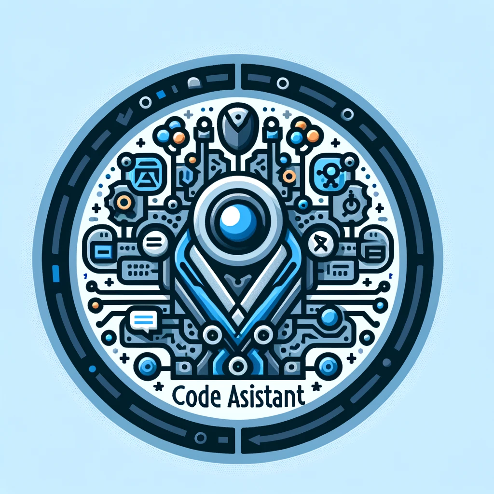

<p align="center">
  
</p>

# Table of contents
- [Table of contents](#table-of-contents)
  - [General info](#general-info)
  - [Technologies](#technologies)
  - [Prerequirements](#prerequirements)
  - [Setup](#setup)
    - [Unique\_config](#unique_config)

## General info
This project is a recruitment task for Opera recruitment process for a position of AI Python Developer.

In this project I have tested most popular LLM models available with non-limiting 
licenses (MIT, Apache 2.0, bsd-3-clause):

* CodeLlama-7b-hf
* CodeGen-350M
* Neo-GPT-125M

## Technologies
Project is created with:
* Python
* PyQt6
* transformers
* pytorch

## Prerequisites
Downloading and cloning of models from Hugging Face will require a registered account on the site and installing git lsf.

To install git lfs execute command:

```git lfs install```

## Setup
To use this project, run using python:
**Python 3.10**

```
$ python llm_code_assistant.py
```

### Unique_config

To install any missing requirements and dependencies execute:

```pip install -r requirements.txt```

To resolve any issues with imports of internal functions execute:

```pip install -e .```