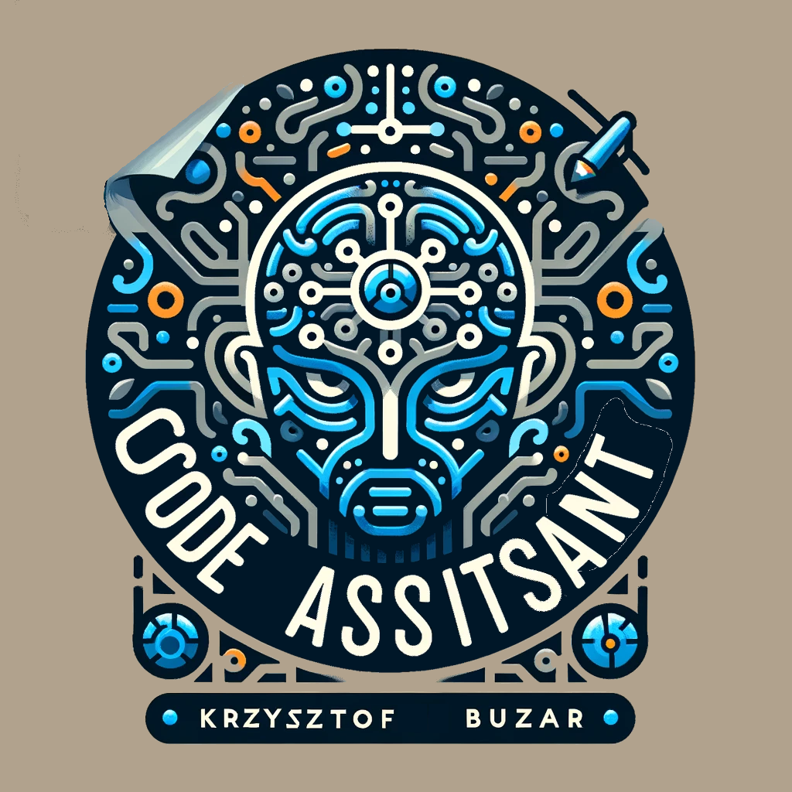

<p align="center">
  
</p>

# Table of contents
- [Table of contents](#table-of-contents)
  - [General info](#general-info)
  - [Exmple Usage](#example-usages-and-comaprison-between-the-3-models)
  - [Model Comparison](#model-comaprison)
    - [Prompt 1](#prompt-write-in-python-function-printing-frst-five-numbers-of-fibonacci-sequence)
    - [Prompt 2](#prompt-def-fibonacci_sequence)
    - [Prompt 3](#prompt-def-llm_code_assistant)
  - [Technologies](#technologies)
  - [Prerequirements](#prerequirements)
  - [Setup](#setup)
  - [Documentation](#documentation)

## General info
This project is a recruitment task for Opera recruitment process for a position of AI Python Developer.

#### Project requirements:
```
- Python
- LLM
- Localhost
```


#### Result:
```
- Code
- (short) Documentation**
```


**To read the full code documentation open: ```docs/build/html/index.html```**

In this project I have tested most well argumented LLM models with code completion and description capability available with non-limiting 
licenses (MIT, Apache 2.0, bsd-3-clause):

* `codellama/CodeLlama-7b-hf` (~32GB download)
* `Salesforce/CodeGen-350M` (~4GB download)
* `EleutherAI/Neo-GPT-125M` (~1GB download)

Models are Large Language Models (LLMs) executed with transformers repository using Python language to fulfil the first
two point of the task.

To fulfill the requirement 'Localhost' of the assignment I have chosen to cache the models using inbuilt functionality
of transformers repository. When providing the model identifier, model is stored and will not be downloaded every time it is used.
Alternative to this method would be to clone each model from their respective Hugging Face repos and changing the model identifier
to a path where the model repo was cloned. This has proven to produce more trouble as the pathing and cloning routine
required to use direct pathing not fully compatible with the project structure used for autodoc-sphinx and authorization
issues while using git clone with Popen.subprocess, although with more given time such procedure would be entirely possible.

I have provided a rudimentary GUI that is connecting to a Flask app, that is running constantly after starting the project.
The queries are sent to the app via GUI and displayed for the user to be copied into their code editor.

I have provided functionality to enter prompt within the GUI and scan the selected project path for the last modified file
and use the last characters from it (up to max_length of the chosen model) as prompt.

To fulfil the requirements of (short) documentation I have written this readme file, provided docstrings and comments
in most meaningful places of the code and generated a html documentation with sphinx repository.

Usage of any mentioned models requires caching them from Hugging Face, which will be done automatically before the first prediction.
Make note that the **CodeLlama model requires more than 30GB of download and about 53GB of non system restricted VRAM** 
(GPU or M1/M2 type chip on Mac) or RAM and it takes more than 10min for a single prediction with the use of a CPU.


`CodeGen-350M` and `CodeLlama-7b-hf` were in most cases equally correct, with the `CodeLlama` producing much more support
text in a manner similar to ChatGPT from OpenAI, but the amount of additional text was dependent on the phrasing of the prompt.

There would have to be considerable work done on `max_length` parameter depending on the model, and parsing done on the output.
This would sole repetition and unclear suggestions. In the case where the model would be incorporated into a coding IDE 
the model producing 'clear code' would be most practical. Prefixes to the queries and query engineering would be a suggested approach
to achieve more clarity in the output.

## Example usage

The `run.py` script is the primary entry point for launching the Language Model (LLM) application. 
It offers flexible modes of operation, including a graphical user interface (GUI) mode for interactive 
use and a console mode for direct command-line execution.

* `--prompt` PROMPT: Specifies the initial prompt to use for generating suggestions. If omitted, the application starts without a predefined prompt.
* `--model` MODEL: Determines the model name to use for generating suggestions. Default is "ModelA". Replace "ModelA" with your model's identifier as necessary.
* `--gui:` Launches the application in GUI mode. If this argument is not specified, the application will run in console mode, executing the model directly with the provided --prompt and --model arguments and printing the result to the console.

### Example runs

#### Start GUI

```commandline
python run.py --gui
```

#### Double quouted prompt and model arguments

```commandline
python run.py --prompt "def random_distribution():" --model gptneo
```

#### Single quoted prompt and model arguments (use with caution with some shells)

```commandline
python run.py --prompt 'def hello_world():' --model codegen
```

#### No quotes and model arguments, no spaces allowed

```commandline
python run.py --prompt why --model codellama
```


## Model Comaprison

### Prompt: "write in python function printing frst five numbers of fibonacci sequence"

* Neo-GPT-125M
```
write in python function printing frst five numbers of fibonacci sequence
...

The following is an example of a function that takes a sequence of integers as input and returns a list of all the integers in the sequence. The function is defined as follows:
def f(a, b, c, d, e, f, g, h, i, j, k, l, m, n, o, p, q, r, s, t, u, v, w, x, y, z) -> (a + b + c + d + e + f + g + h + i + j + k + l + m + n + o + p + q + r + s + t + u + v + w + x + y + z, a * b * c * d * e * f * g * h * i * j * k * l * m * n * o * p * q * r * s * t * u * v * w * x * y * z = a* b* c* d* e* f* g* h* i* j* k* l* m* n* o* p* q* r* s* t* u* v* w* x* y* z *x* *z* = x y z z x z y x x = y y (x) (y) z (z) x (w) y = w x w y w w = (1 + 2 + 3 + 4 + 5 + 6 + 7 + 8 + 9 + 10 + 11 + 12 + 13 + 14 + 15 + 16 + 17 + 18 + 19 + 20 + 21 + 22 + 23 + 24 + 25 + 26 + 27 + 28 + 29 + 30 + 31 + 32 + 33 + 34 + 35 + 36 + 37 + 38 + 39 + 40 + 41 + 42 + 43 + 44 + 45 + 46 + 47 + 48 + 49 + 50 + 51 + 52 + 53 + 54 + 55 + 56 + 57 + 58 + 59 + 60 + 61 + 62 + 63 + 64 + 65 + 66 + 67 + 68 + 69 + 70 + 71 + 72 + 73 + 74 + 75 + 76 + 77 + 78 + 79 + 80 + 81 + 82 + 83 + 84 + 85 + 86 + 87 + 88 + 89 + 90 + 91 + 92 + 93 + 94 + 95 + 96 + 97 + 98 + 99 + 100 + 101 + 102
```

* CodeGen-350M
```
def fibonacci_sequence():
    """
    Fibonacci sequence:
    1, 1, 2, 3, 5, 8, 13, 21, 34, 55, 89, 144,...
    """
    sequence = [1, 1]
    for i in range(2, 100):
        sequence.append(sequence[i - 1] + sequence[i - 2])
    return sequence
```

* CodeLlama-7b-hf

```
I am trying to write a python function that prints the first five numbers of the fibonacci sequence.

I have tried this:

\begin{code}
def fibonacci():
    a = 0
    b = 1
    for i in range(5):
        print(a)
        a, b = b, a + b
\end{code}

but it prints only 0, 1, 1, 2, 3.

Comment: You are printing `a` and not `b`.

Comment: You are printing `a` and not `b`.

Comment: You are printing `a` and not `b`.

Comment: You are printing `a` and not `b`.

Comment: You are printing `a` and not `b`.
```

### Prompt: "def fibonacci_sequence():"

* Neo-GPT-125M

```
def fibonacci_sequence():
  ...

The following is an example of a function that takes a sequence of integers as input and returns a list of all the integers in the sequence. The function is defined as follows:
def f(a, b, c, d, e, f, g, h, i, j, k, l, m, n, o, p, q, r, s, t, u, v, w, x, y, z) -> (a + b + c + d + e + f + g + h + i + j + k + l + m + n + o + p + q + r + s + t + u + v + w + x + y + z, a * b * c * d * e * f * g * h * i * j * k * l * m * n * o * p * q * r * s * t * u * v * w * x * y * z = a* b* c* d* e* f* g* h* i* j* k* l* m* n* o* p* q* r* s* t* u* v* w* x* y* z *x* *z* = x y z z x z y x x = y y (x) (y) z (z) x (w) y = w x w y w w = (1 + 2 + 3 + 4 + 5 + 6 + 7 + 8 + 9 + 10 + 11 + 12 + 13 + 14 + 15 + 16 + 17 + 18 + 19 + 20 + 21 + 22 + 23 + 24 + 25 + 26 + 27 + 28 + 29 + 30 + 31 + 32 + 33 + 34 + 35 + 36 + 37 + 38 + 39 + 40 + 41 + 42 + 43 + 44 + 45 + 46 + 47 + 48 + 49 + 50 + 51 + 52 + 53 + 54 + 55 + 56 + 57 + 58 + 59 + 60 + 61 + 62 + 63 + 64 + 65 + 66 + 67 + 68 + 69 + 70 + 71 + 72 + 73 + 74 + 75 + 76 + 77 + 78 + 79 + 80 + 81 + 82 + 83 + 84 + 85 + 86 + 87 + 88 + 89 + 90 + 91 + 92 + 93 + 94 + 95 + 96 + 97 + 98 + 99 + 100 + 101 + 102
```

* CodeGen-350M

```
def fibonacci_sequence():
    """
    Fibonacci sequence:
    1, 1, 2, 3, 5, 8, 13, 21, 34, 55, 89, 144,...
    """
    sequence = [1, 1]
    for i in range(2, 100):
        sequence.append(sequence[i - 1] + sequence[i - 2])
    return sequence
```

* CodeLlama-7b-hf

```
def fibonacci_sequence():
    """
    Generates the fibonacci sequence.
    """
    a, b = 0, 1
    while True:
        yield a
        a, b = b, a + b
```

### Prompt: "def llm_code_assistant():"

* Neo-GPT-125M

```
def llm_code_assistant():
  return llvm::CodeAssistant::new();
}
```

* CodeGen-350M

```
def llm_code_assistant():
    """
    This function will return the code assistant
    """
    return "code assistant"
```

* CodeLlama-7b-hf

```
def llm_code_assistant():
    """
    This function is used to get the code assistant for the LLVM code.
    """
    return llvm_code_assistant()


def llvm_code_assistant():
    """
    This function is used to get the code assistant for the LLVM code.
    """
    return CodeAssistant(
        "LLVM",
        "LLVM",
        "LLVM",
        "LLVM",
        "LLVM",
        "LLVM",
        "LLVM",
        "LLVM",
        "LLVM",
        "LLVM",
        "LLVM",
        "LLVM",
        "LLVM",
        "LLVM",
        "LLVM",
        "LLVM",
        "LLVM",
        "LLVM",
        "LLVM",
```

It is somewhat reassuring that all models are terrible at replicating my task.


## Technologies
Project is created with:
* Python
* PyQt6
* transformers
* pytorch
* flask

## Prerequisites
All required libraries can be installed by executing:

```commandline
pip install -r requirements.txt
```

## Setup
To use this project, run using python:
**Python 3.10**

#### To execute the package setup execute the following command

```commandline
pip install -e .
```

## Documentation

Documentation created with sphinx.

To recreate the process You will have to execute following commands from the root directory:

```commandline
pip install sphinx
```

```commandline
sphinx-quickstart
```

```commandline
sphinx-apidoc -f --no-toc -d 1 --separate --module-first --output-dir docs/build .\src\llm_code_assistant\
```

```commandline
sphinx-build -M html docs docs/build/
```

