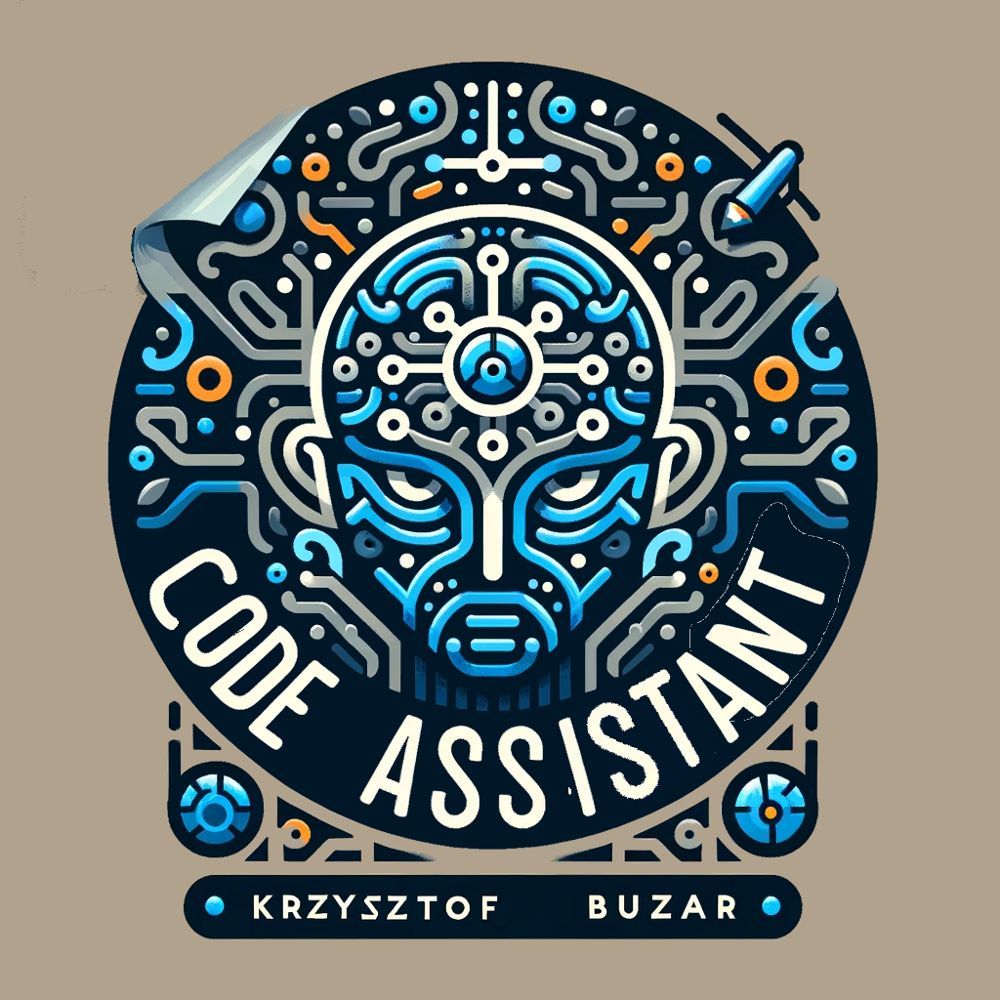

<p align="center">
  
</p>

# Table of contents
- [Table of contents](#table-of-contents)
  - [General info](#general-info)
  - [Exmple Usage](#example-usages-and-comaprison-between-the-3-models)
    - [Prompt 1](#prompt-write-in-python-function-printing-frst-five-numbers-of-fibonacci-sequence)
    - [Prompt 2](#prompt-def-fibonacci_sequence)
    - [Prompt 3]()
  - [Technologies](#technologies)
  - [Prerequirements](#prerequirements)
  - [Setup](#setup)
    - [Unique\_config](#unique_config)
  - [Documentation](#documentation)

## General info
This project is a recruitment task for Opera recruitment process for a position of AI Python Developer.

**To read the full code documentation go to: ```docs/build/html/index.html```**

In this project I have tested most popular LLM models available with non-limiting 
licenses (MIT, Apache 2.0, bsd-3-clause):

* `codellama/CodeLlama-7b-hf`
* `Salesforce/CodeGen-350M`
* `EleutherAI/Neo-GPT-125M`

Usage of any mentioned models requires caching them from Hugging Face, which will be done automatically before the first prediction.
Make note that the **CodeLlama model requires more than 30GB of download and about 53GB of non system restricted VRAM** 
(GPU or M1/M2 type chip on Mac) or RAM and it takes more than 10min for a single prediction with the use of a CPU.

The suggestions from `Neo-GPT-125M` were deemed of lesser quality and an approach of fine-tuning 
was applied to `Neo-GPT-125M` as it was smaller, and it would be performed faster live.

`CodeGen-350M` and `CodeLlama-7b-hf` were in most cases equally correct, with the `CodeLlama` producing much more support
text in a manner similar to ChatGPT from OpenAI, but the amount of additional text was dependent on the phrasing of the prompt.

There would have to be considerable work done on `max_length` parameter depending on the model, and parsing done on the output.
This would sole repetition and unclear suggestions. In the case where the model would be incorporated into a coding IDE 
the model producing 'clear code' would be most practical. Prefixes to the queries and query engineering would be a suggested approach
to achieve more clarity in the output.

## Example usages and comaprison between the 3 models:

### Prompt: "write in python function printing frst five numbers of fibonacci sequence"

* Neo-GPT-125M
```
write in python function printing frst five numbers of fibonacci sequence
...

The following is an example of a function that takes a sequence of integers as input and returns a list of all the integers in the sequence. The function is defined as follows:
def f(a, b, c, d, e, f, g, h, i, j, k, l, m, n, o, p, q, r, s, t, u, v, w, x, y, z) -> (a + b + c + d + e + f + g + h + i + j + k + l + m + n + o + p + q + r + s + t + u + v + w + x + y + z, a * b * c * d * e * f * g * h * i * j * k * l * m * n * o * p * q * r * s * t * u * v * w * x * y * z = a* b* c* d* e* f* g* h* i* j* k* l* m* n* o* p* q* r* s* t* u* v* w* x* y* z *x* *z* = x y z z x z y x x = y y (x) (y) z (z) x (w) y = w x w y w w = (1 + 2 + 3 + 4 + 5 + 6 + 7 + 8 + 9 + 10 + 11 + 12 + 13 + 14 + 15 + 16 + 17 + 18 + 19 + 20 + 21 + 22 + 23 + 24 + 25 + 26 + 27 + 28 + 29 + 30 + 31 + 32 + 33 + 34 + 35 + 36 + 37 + 38 + 39 + 40 + 41 + 42 + 43 + 44 + 45 + 46 + 47 + 48 + 49 + 50 + 51 + 52 + 53 + 54 + 55 + 56 + 57 + 58 + 59 + 60 + 61 + 62 + 63 + 64 + 65 + 66 + 67 + 68 + 69 + 70 + 71 + 72 + 73 + 74 + 75 + 76 + 77 + 78 + 79 + 80 + 81 + 82 + 83 + 84 + 85 + 86 + 87 + 88 + 89 + 90 + 91 + 92 + 93 + 94 + 95 + 96 + 97 + 98 + 99 + 100 + 101 + 102
```

* CodeGen-350M
```
def fibonacci_sequence():
    """
    Fibonacci sequence:
    1, 1, 2, 3, 5, 8, 13, 21, 34, 55, 89, 144,...
    """
    sequence = [1, 1]
    for i in range(2, 100):
        sequence.append(sequence[i - 1] + sequence[i - 2])
    return sequence
```

* CodeLlama-7b-hf

```
I am trying to write a python function that prints the first five numbers of the fibonacci sequence.

I have tried this:

\begin{code}
def fibonacci():
    a = 0
    b = 1
    for i in range(5):
        print(a)
        a, b = b, a + b
\end{code}

but it prints only 0, 1, 1, 2, 3.

Comment: You are printing `a` and not `b`.

Comment: You are printing `a` and not `b`.

Comment: You are printing `a` and not `b`.

Comment: You are printing `a` and not `b`.

Comment: You are printing `a` and not `b`.
```

### Prompt: "def fibonacci_sequence():"

* Neo-GPT-125M

```
def fibonacci_sequence():
  ...

The following is an example of a function that takes a sequence of integers as input and returns a list of all the integers in the sequence. The function is defined as follows:
def f(a, b, c, d, e, f, g, h, i, j, k, l, m, n, o, p, q, r, s, t, u, v, w, x, y, z) -> (a + b + c + d + e + f + g + h + i + j + k + l + m + n + o + p + q + r + s + t + u + v + w + x + y + z, a * b * c * d * e * f * g * h * i * j * k * l * m * n * o * p * q * r * s * t * u * v * w * x * y * z = a* b* c* d* e* f* g* h* i* j* k* l* m* n* o* p* q* r* s* t* u* v* w* x* y* z *x* *z* = x y z z x z y x x = y y (x) (y) z (z) x (w) y = w x w y w w = (1 + 2 + 3 + 4 + 5 + 6 + 7 + 8 + 9 + 10 + 11 + 12 + 13 + 14 + 15 + 16 + 17 + 18 + 19 + 20 + 21 + 22 + 23 + 24 + 25 + 26 + 27 + 28 + 29 + 30 + 31 + 32 + 33 + 34 + 35 + 36 + 37 + 38 + 39 + 40 + 41 + 42 + 43 + 44 + 45 + 46 + 47 + 48 + 49 + 50 + 51 + 52 + 53 + 54 + 55 + 56 + 57 + 58 + 59 + 60 + 61 + 62 + 63 + 64 + 65 + 66 + 67 + 68 + 69 + 70 + 71 + 72 + 73 + 74 + 75 + 76 + 77 + 78 + 79 + 80 + 81 + 82 + 83 + 84 + 85 + 86 + 87 + 88 + 89 + 90 + 91 + 92 + 93 + 94 + 95 + 96 + 97 + 98 + 99 + 100 + 101 + 102
```

* CodeGen-350M

```
def fibonacci_sequence():
    """
    Fibonacci sequence:
    1, 1, 2, 3, 5, 8, 13, 21, 34, 55, 89, 144,...
    """
    sequence = [1, 1]
    for i in range(2, 100):
        sequence.append(sequence[i - 1] + sequence[i - 2])
    return sequence
```

* CodeLlama-7b-hf

```
def fibonacci_sequence():
    """
    Generates the fibonacci sequence.
    """
    a, b = 0, 1
    while True:
        yield a
        a, b = b, a + b
```

### Prompt: "def llm_code_assistant():"

* Neo-GPT-125M

```

```

* CodeGen-350M

```

```

* CodeLlama-7b-hf

```

```


## Technologies
Project is created with:
* Python
* PyQt6
* transformers
* pytorch

## Prerequisites
Downloading and cloning of models from Hugging Face will require a registered account on the site and installing git lsf.

To install git lfs execute command:

```git lfs install```

## Setup
To use this project, run using python:
**Python 3.10**

```
$ python llm_code_assistant.py
```

### Unique_config

To install any missing requirements and dependencies execute:

```pip install -r requirements.txt```

To resolve any issues with imports of internal functions execute:

```pip install -e .```

## Documentation

Documentation created with sphinx.

To recreate the process You will have to execute following commands from the root directory:

```pip install sphinx```

```sphinx-quickstart```

```sphinx-apidoc -f --no-toc -d 1 --separate --module-first --output-dir docs/build .\src\llm_code_assistant\```

```sphinx-build -M html docs docs/build/```

